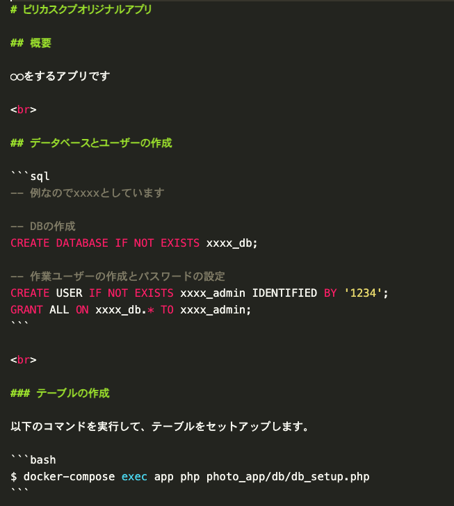

# ピリカスクプオリジナルアプリ

## 概要

◯◯をするアプリです

<br>

## データベースとユーザーの作成

```sql
-- 例なのでxxxxとしています

-- DBの作成
CREATE DATABASE IF NOT EXISTS xxxx_db;

-- 作業ユーザーの作成とパスワードの設定
CREATE USER IF NOT EXISTS xxxx_admin IDENTIFIED BY '1234';
GRANT ALL ON xxxx_db.* TO xxxx_admin;
```

<br>

### テーブルの作成

以下のコマンドを実行して、テーブルをセットアップします。

```bash
$ docker-compose exec app php photo_app/db/db_setup.php
```

# ピリカスクプオリジナルアプリ

## 概要

◯◯をするアプリです

<br>

## データベースとユーザーの作成

```sql
-- 例なのでxxxxとしています

-- DBの作成
CREATE DATABASE IF NOT EXISTS xxxx_db;

-- 作業ユーザーの作成とパスワードの設定
CREATE USER IF NOT EXISTS xxxx_admin IDENTIFIED BY '1234';
GRANT ALL ON xxxx_db.* TO xxxx_admin;
```

<br>

### テーブルの作成

以下のコマンドを実行して、テーブルをセットアップします。

```bash
$ docker-compose exec app php photo_app/db/db_setup.php
```

<br>

<br>

上記の内容をマークダウンで記述した場合は、以下のようになります。


